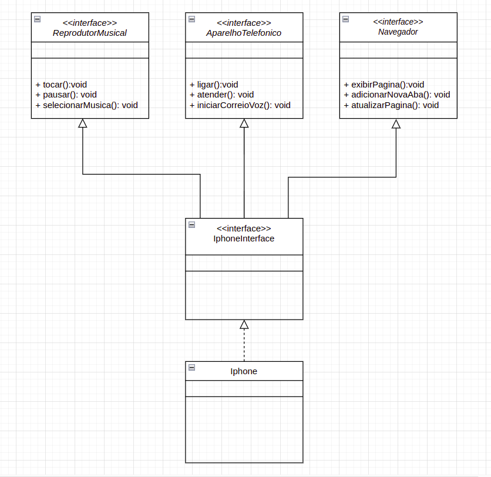

# Diagramação de Classes do Iphone

### Foi proposta a a diagramação das classes do Iphone utilizando uma ferramenta de UML (no meu caso utilizei o draw.io), que contemplasse os seguintes comportamentos:

- Reprodutor Musical: tocar, pausar, selecionarMusica
- Aparelho Telefônico: ligar atender, iniciarCorreioVoz
- Navegador: exibirPagina, adicionarNovaAba, atualizarPagina

### Após a diagramação, foram criadas as seguintes classes e interfaces em Java: 

- as interfaces `ReprodutorMusical`, `AparelhoTelefonico`, `Navegador`, as quais são herdadas pela outra interface `IphoneInterface`;

- a classe `Iphone` que implementa todos os métodos de `IphoneInterface`, herdados das outras interfaces;

- a classe `Application` para demonstrar a instância de `Iphone` e a chamadas dos seus métodos.  

